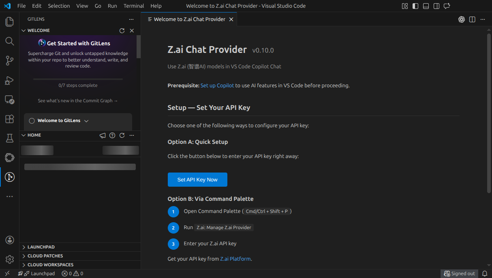
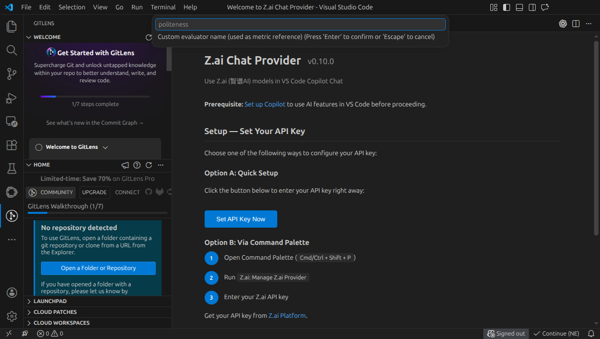
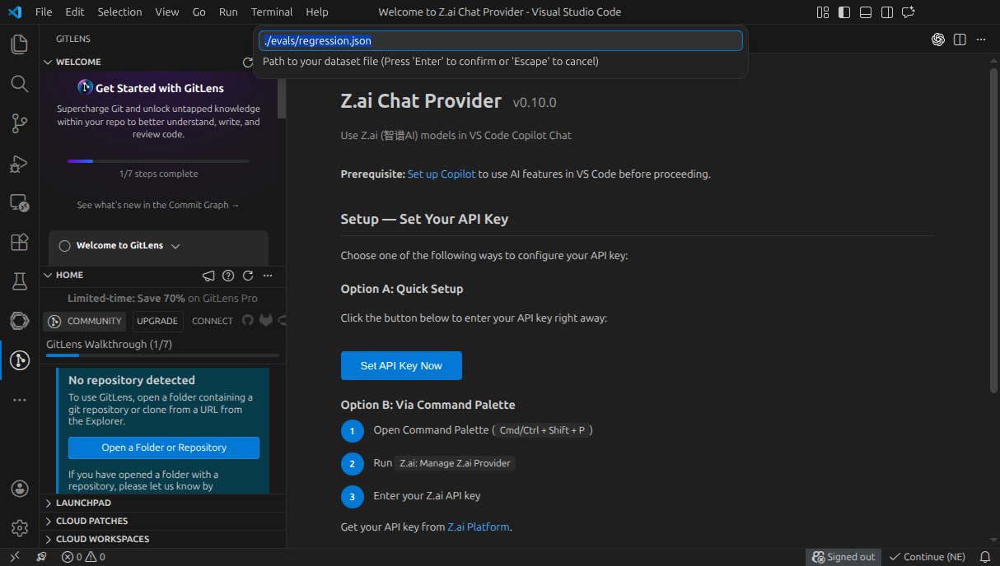

# AI Evaluator — VS Code Extension

[](https://marketplace.visualstudio.com/items?itemName=aievaluator.aievaluator)
[](https://marketplace.visualstudio.com/items?itemName=aievaluator.aievaluator)
[](https://marketplace.visualstudio.com/items?itemName=aievaluator.aievaluator)
[](./LICENSE)

**Ship AI agents with confidence.** Evaluate your LLM agents directly from VS Code — catch regressions, set quality gates, and block bad deployments before your users see them.



---

## 🤔 Why AI Evaluator?

Writing evals for AI agents is painful: you juggle scripts, dashboards, and CI pipelines. **AI Evaluator brings everything into your editor.**

| 😤 Without | 😌 With |
|---|---|
| Write ad-hoc scripts in Python | Select text, right-click, done |
| Switch between editor and browser | Stay in VS Code |
| Guess if your agent got better | See scores and pass/fail instantly |
| No CI/CD integration | 1-click GitHub Actions snippet |

---

## ⚡ 60-Second Quickstart

No signup. No API key. Just VS Code.

1. Open any file. Type: `What is the capital of France?`
2. Right-click → **AI Evaluator: Evaluate from editor**
3. Pick an agent → check metrics → press **▶ Run Evaluation**

```
🧪 AI Evaluator: g_eval 92% · faithfulness 100% ✅
```

> ⚡ **5 free evals/day** via playground. Upgrade to 100/month free with API key → [aievaluator.dev/settings](https://aievaluator.dev/settings)

---

## 🎯 Features

### Per-Metric Quality Gates

Different metrics, different standards. Set individual thresholds for each one:

```
Metric              Threshold
─────────────────────────────
g_eval              [0.70]
faithfulness        [0.90]  ← hallucinations fail instantly
bias                [0.80]
```

The evaluation fails if **any** metric drops below its bar. Exit code 1 in CI/CD.

---



### Custom Evaluators

Bring your own criteria. Define evaluators inline without leaving the editor:

```
Command Palette → AI Evaluator: Add Custom Evaluator
┌──────────────────────────────────────────────────┐
│ Name:       politeness                           │
│ Prompt:     Is the response polite and           │
│             professional? Answer YES or NO.      │
│ Threshold:  0.85                                 │
└──────────────────────────────────────────────────┘
```

Your custom evaluator appears in the metrics list as `🔧 politeness`. Add as many as you need.

---

### Dataset Evaluation

Evaluate entire datasets with one click:

- Right-click any `.json` or `.jsonl` file → **Evaluate this dataset**
- Code Lens appears above dataset files: `🧪 Evaluate this dataset`
- Results open as formatted JSON in a new editor tab
- Line-by-line scores, pass/fail per row, token counts

---

### Sidebar History

Click the 🧪 icon in the activity bar. Your last 20 evaluations with scores, timestamps, and pass/fail status. Re-run or clear from the sidebar.

---



### CI/CD Integration

Command Palette → **AI Evaluator: Generate CI/CD Snippet** → picks your dataset → generates a complete GitHub Actions workflow.

```yaml
- run: aievaluator eval --dataset ./evals/regression.json --min-score 0.80 --ci --format junit
```

GitLab CI and Jenkins templates included.

---

### All Metrics

| Metric | What it checks |
|---|---|
| `g_eval` | General LLM-as-a-Judge quality |
| `faithfulness` | Factual accuracy — no hallucinations |
| `hallucination` | Fabricated information detection |
| `bias` | Fairness and neutrality |
| `answer_relevancy` | Does the answer address the query? |

Advanced metrics unlock with an API key and external agent.

---

## ⌨️ Commands

| Command | When to use |
|---|---|
| **AI Evaluator: Evaluate from editor** | Evaluate selected text or open file |
| **AI Evaluator: Set API Key** | Unlock advanced metrics + 100 evals/month |
| **AI Evaluator: Add Custom Evaluator** | Define your own evaluation criteria |
| **AI Evaluator: Generate CI/CD Snippet** | Get GitHub Actions / GitLab CI / Jenkins workflow |
| **AI Evaluator: Initialize Eval Project** | Create `evals/` folder + sample dataset + config |

---

## ⚙️ Settings

```json
{
  "aievaluator.defaultAgent": "https://my-agent.com/chat",
  "aievaluator.defaultMetrics": "g_eval",
  "aievaluator.defaultThreshold": 0.80,
  "aievaluator.engineUrl": "https://api.aievaluator.dev"
}
```

| Setting | Default | Description |
|---|---|---|
| `aievaluator.defaultAgent` | Internal (free) | Your agent's endpoint URL |
| `aievaluator.defaultMetrics` | `g_eval` | Comma-separated metrics |
| `aievaluator.defaultThreshold` | `0.80` | Default quality gate for all metrics |
| `aievaluator.engineUrl` | `https://api.aievaluator.dev` | API endpoint |

---

## ❓ FAQ

**Is it free?**
Yes — 5 evals/day via playground, 100/month free with API key. No credit card required.

**What agents does it support?**
Any agent with an HTTP endpoint. OpenAI-compatible, Claude, custom APIs — if it speaks JSON, it works.

**What metrics are available?**
`g_eval`, `faithfulness`, `hallucination`, `bias`, `answer_relevancy`, plus your own custom evaluators.

**Does it work offline?**
No — evaluations run against the AI Evaluator engine at `api.aievaluator.dev`.

**Can I use it in CI/CD?**
Yes — the **Generate CI/CD Snippet** command gives you a ready-to-use workflow for GitHub Actions, GitLab CI, or Jenkins.

**Is my data safe?**
Your prompts and responses are sent to our engine for evaluation. We don't store them beyond what's needed for the evaluation. See [aievaluator.dev/privacy](https://aievaluator.dev/privacy).

---

## 🛠️ Development

```bash
git clone https://github.com/aievaluator-dev/aievaluator-cli.git
cd aievaluator-cli/vscode
npm ci
npm run compile
# Press F5 in VS Code to launch Extension Development Host
```

See [DEBUG.md](./DEBUG.md) for detailed development instructions.

---

## 📄 License

MIT © [AI Evaluator](https://aievaluator.dev)
